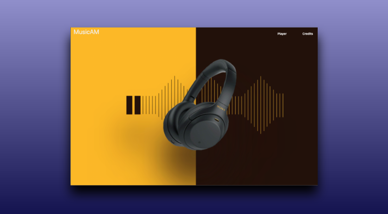
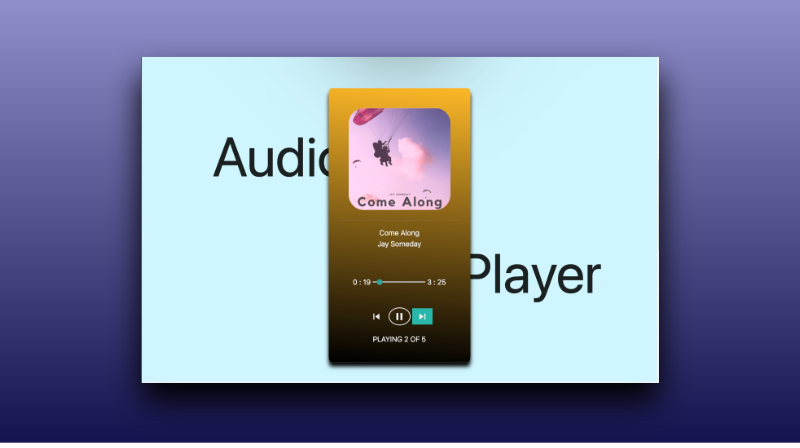
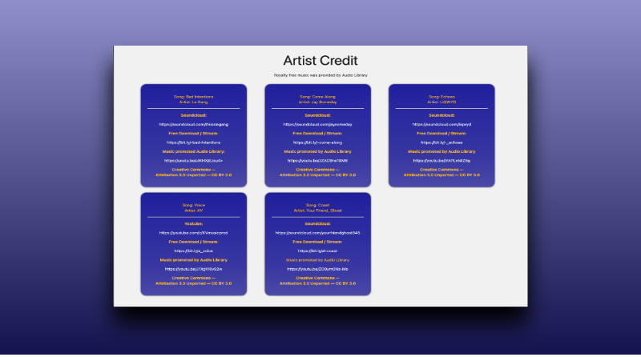

<!-- Title -->
  <h1 align="center">Audio Player</h1>

  <p align="center">
    An Audio Player Project
    <br />
    <br />
    <a href="">View Demo</a>
  </p>
</p>

<!-- TABLE OF CONTENTS -->
<details open="open">
  <summary>Table of Contents</summary>
  <ol>
    <li>
      <a href="#about-the-project">About The Project</a>
      <ul>
        <li><a href="#objectives">Objectives</a></li>
        <li><a href="#built-with">Built With</a></li>
      </ul>
    </li>
    <li>
      <a href="#getting-started">Getting Started</a>
      <ul>
        <li><a href="#installation">Installation</a></li>
      </ul>
    </li>
    <li><a href="#contact">Contact</a></li>
    <li><a href="#acknowledgements">Acknowledgements</a></li>
  </ol>
</details>
<br/>
<br/>

<!-- ABOUT THE PROJECT -->
## About The Project

As a fan of music, I wanted to build an app that would utilize HTML, CSS, and Javascript.


<br />
<br />

<br />
<br />

<br />
<br />

### Objectives:
* Create an audio player that can Play, Pause, Play Next, and Play Previous Track.
* Store the song information in an array. The array has the following information: <br />
  * Tack File
  * Tack Name
  * Artist Name
  * Track Art
  * Song Name
* When the user clicks on a button (play, next, etc), the track information mentioned above will display.

### Built With

The following frameworks were used to complete the project.
* [HTML5](https://developer.mozilla.org/en-US/docs/Web/Guide/HTML/HTML5)
* [MaterializeCSS](https://materializecss.com/)
* [Javascript](https://www.javascript.com/)

<!-- GETTING STARTED -->
## Getting Started
The project can either be viewed at this link [Audio Player](www.heroku.com/) or the code can be cloned onto a local machine with the steps below.

### Installation
1. Clone the repository:
   ```sh
   git clone https://github.com/aamir-malik22188/audio-player.git
   ```

2. Start project.

<!-- CONTACT -->
## Contact
Aamir Malik - Aamir22188@gmail.com

Project Repo: https://github.com/aamir-malik22188/audio-player

Twitter Handle: [@TheRealAamir](https://twitter.com/TheRealAamir)

<!-- ACKNOWLEDGEMENTS -->
## Acknowledgements
* [Heroku](www.heroku.com/)
* [W3 Schools](https://www.w3schools.com/)
* [Audio Library](https://www.audiolibrary.com.co/)
* [SMU Bootcamp](https://techbootcamps.smu.edu/)
